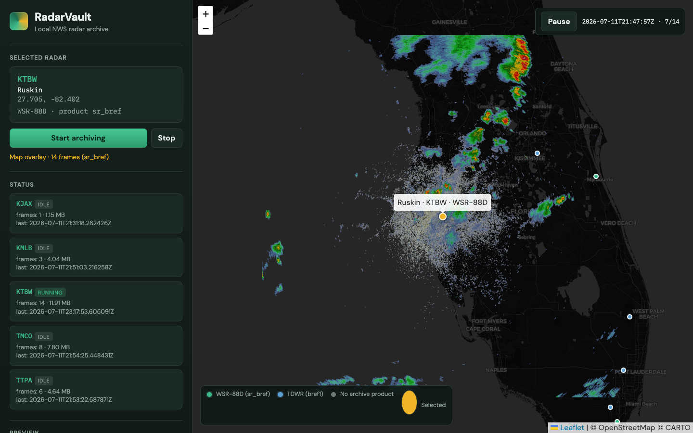
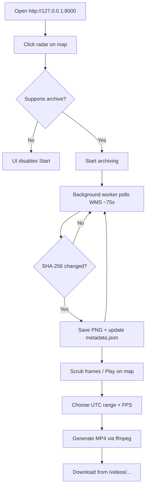
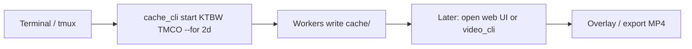
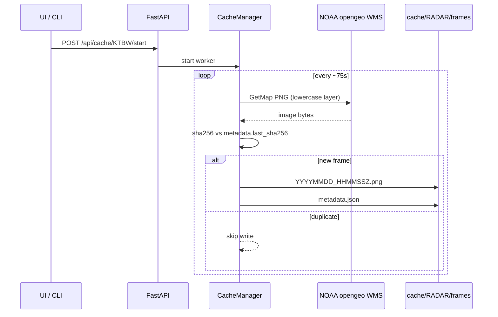
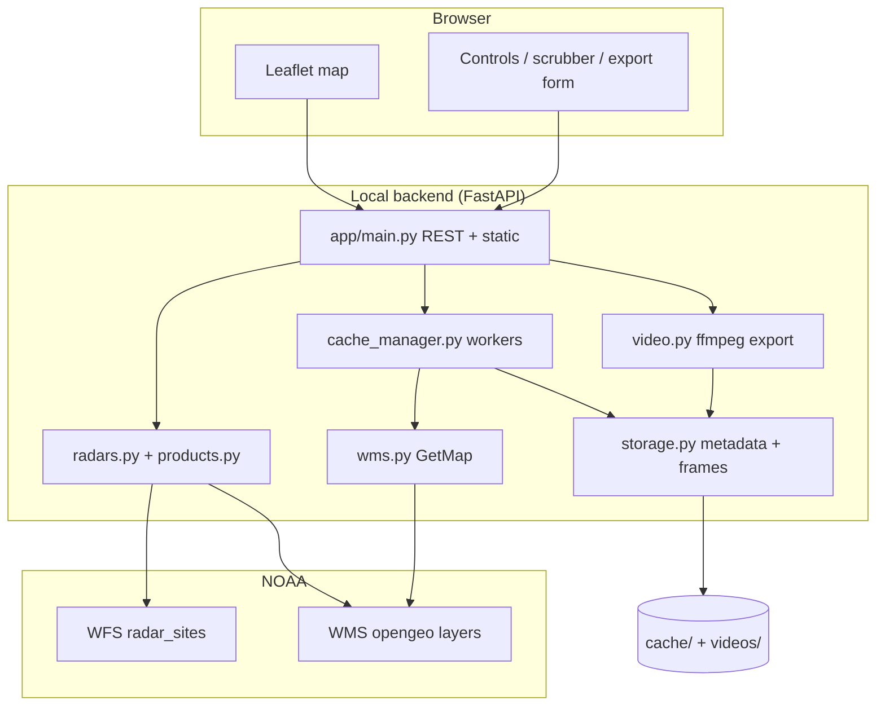

# RadarVault

**Local-first NWS radar archiver + high-resolution time-lapse generator.**

Cache every new volume scan from NOAA opengeo on your machine, scrub frames on an interactive map, and export smooth MP4s — no cloud account, no upload pipeline.

<p>
  
  
  
  
</p>

<p align="center">
  
</p>

<p align="center"><em>KTBW (Ruskin) Base Reflectivity playing as a georeferenced map overlay while frames archive locally.</em></p>

---

## Table of contents

- [Why RadarVault](#why-radarvault)
- [Features](#features)
- [Quick start](#quick-start)
- [Control flows](#control-flows)
- [Architecture](#architecture)
- [Repository map](#repository-map)
- [CLI (headless)](#cli-headless)
- [Web UI walkthrough](#web-ui-walkthrough)
- [Storage layout](#storage-layout)
- [HTTP API](#http-api)
- [Configuration](#configuration)
- [Notes & limits](#notes--limits)

---

## Why RadarVault

Public radar loops are often sparse (every few minutes). Subtle motion — inflow, rotation, outflow boundaries — is easier to see when you keep **every** new scan at high resolution.

RadarVault polls NOAA’s WMS on a polite interval (~75s by default), stores only **new** frames (SHA-256 dedupe), and lets you:

1. Leave it archiving overnight (UI or CLI / `tmux`)
2. Preview & scrub locally
3. Play frames as a map overlay
4. Export an MP4 when you’re ready

Everything stays under `cache/` and `videos/` on disk.

---

## Features

| Feature | What you get |
|---------|----------------|
| **Interactive map** | Leaflet UI of NWS WSR-88D + airport TDWR sites |
| **Smart products** | Prefers `sr_bref` (WSR-88D); falls back to `bref1` / `brefl` (TDWR) |
| **Local archive** | Timestamped PNGs in `cache/{RADAR_ID}/frames/` |
| **Deduped polling** | Unchanged scans are not rewritten |
| **Multi-radar** | Independent workers + status (frames, disk, last time) |
| **Map overlay** | Animate cached frames georeferenced over the basemap |
| **Frame scrubber** | Sidebar preview before you export |
| **MP4 export** | ffmpeg H.264 (CRF 18, yuv420p, `+faststart`) |
| **Background video jobs** | Submit, monitor, cancel, and download exports without holding an HTTP request open |
| **Bounded frame API** | Range/cursor queries with lightweight preview URLs |
| **Storage operations** | Quota/free-space status and dry-run retention plans |
| **Optional analysis** | Provenance-labelled cell/nowcast endpoints; disabled by default |
| **Headless CLI** | Archive for `2d` / `48h` without opening the browser |

**Marker legend**

| Color | Meaning |
|-------|---------|
| Green | WSR-88D with `sr_bref` |
| Blue | TDWR with `bref1` / `brefl` |
| Grey | No supported archive product |
| Gold | Currently selected |

---

## Quick start

### 1. Dependencies

```bash
# ffmpeg is required for video export
brew install ffmpeg          # macOS
# sudo apt install ffmpeg    # Ubuntu/Debian

python3 -m venv .venv
source .venv/bin/activate
pip install -r requirements.txt
```

### 2. Run the app

```bash
python -m app
```

Open **[http://127.0.0.1:8000](http://127.0.0.1:8000)**.

### 3. First loop

1. Click a radar (e.g. **KTBW**).
2. **Start archiving** — leave it for a while.
3. **Play on map** to animate cached frames.
4. Set a UTC time range + FPS → **Generate MP4** → download.

Optional: copy `.env.example` → `.env` to tune poll interval, image size, host/port.

---

## Control flows

### A. Interactive archive → overlay → video



### B. Headless multi-day archive (no browser)



### C. Request path (single poll)



---

## Architecture



**Product selection**

1. Discover layers from WMS GetCapabilities → `data/product_index.json`
2. Prefer `sr_bref` → else `bref1` → else `brefl`
3. Coverage bbox: ~230 km (WSR-88D) or ~90 km (TDWR)

---

## Repository map

```text
weatherapp/
├── app/                  # Python backend
│   ├── main.py           # FastAPI app, REST routes, static mount
│   ├── config.py         # Paths, poll/image defaults, bbox math
│   ├── radars.py         # WFS inventory + site annotations
│   ├── products.py       # Layer discovery / preferred product
│   ├── wms.py            # High-res GetMap fetch + PNG validation
│   ├── storage.py        # metadata.json, frame listing, dedupe save
│   ├── cache_manager.py  # Per-radar background poll workers
│   ├── cache_cli.py      # Headless archive CLI (--for 2d, multi-radar)
│   ├── video.py          # ffmpeg MP4 export
│   ├── video_cli.py      # CLI export wrapper
│   └── __main__.py       # python -m app
├── static/               # Leaflet UI (no build step)
│   ├── index.html
│   ├── app.js
│   └── styles.css
├── tests/                # pytest (dedupe, health, CLI durations, …)
├── docs/screenshots/     # README images
├── cache/                # Runtime archives (gitignored frames)
├── videos/               # Runtime MP4s (gitignored)
├── PLAN.md               # Milestone checklist
├── requirements.txt
└── .env.example
```

### Module responsibilities

| Module | Role |
|--------|------|
| `main.py` | HTTP surface: health, radars, cache start/stop/status, frames, overlay bounds, video export, UI |
| `radars.py` | Load ~200+ sites from WFS; attach `product`, `kind`, `supports_archive` |
| `products.py` | Parse capabilities; pick best reflectivity product per ICAO |
| `wms.py` | Build lowercase WMS URLs; validate PNG; return bytes + bbox |
| `storage.py` | Atomic-ish frame writes; resume via `last_sha256`; list by UTC range |
| `cache_manager.py` | Threaded workers, backoff on errors, multi-radar status |
| `cache_cli.py` | Same engine without the web server |
| `video.py` / `video_cli.py` | Stage frames → libx264 MP4 |
| `static/app.js` | Map markers, archive controls, scrubber, overlay player, export form |

---

## CLI (headless)

Same `cache/` the UI reads — no browser required.

```bash
source .venv/bin/activate

# Single poll
python -m app.cache_cli start KTBW --once
python -m app.cache_cli start TMCO --once   # TDWR (Orlando)

# Archive for 2 days
python -m app.cache_cli start KTBW --for 2d

# Several radars, 48h, status every 15 minutes
python -m app.cache_cli start KTBW TMCO KJAX --for 48h --status-every 15m

# Until Ctrl+C
python -m app.cache_cli start KTBW

python -m app.cache_cli status

# Export
python -m app.video_cli export KTBW \
  --start 2020-01-01 --end 2099-01-01 \
  --fps 12 --out videos/ktbw_loop.mp4
```

Durations accept `90`, `30m`, `2h`, `2d`, `1d12h`, `48h`.

**Keep long runs alive**

```bash
tmux new -s radar
python -m app.cache_cli start KTBW TMCO --for 2d
# detach: Ctrl+b, then d
```

---

## Web UI walkthrough

1. **Map** — all sites; hover for name + ID + kind.
2. **Selected radar** — Start / Stop archiving.
3. **Status** — per-radar running/idle, frame count, disk use, last frame time.
4. **Preview** — latest frame + scrubber.
5. **Play on map** — georeferenced animation (uses all cached frames for that radar).
6. **Generate video** — UTC start/end + FPS → MP4 download link.

Selecting a radar syncs the export time window to its cached frame range (UTC).

---

## Storage layout

```text
cache/
  KTBW/
    metadata.json          # last hash, bbox, product, frame_count, …
    frames/
      20260711_171234Z.png # UTC timestamps
  TMCO/
    ...
videos/
  KTBW_20260710_20260711_15fps.mp4
```

Restarting resumes from `metadata.json` and will not re-save an unchanged current scan.

---

## HTTP API

| Method | Path | Description |
|--------|------|-------------|
| `GET` | `/api/health` | Liveness + ffmpeg availability |
| `GET` | `/api/radars` | Inventory + product / archive support |
| `GET` | `/api/radars/{id}` | One site + metadata + bounds |
| `POST` | `/api/cache/{id}/start` | Start archiving |
| `POST` | `/api/cache/{id}/stop` | Stop archiving |
| `GET` | `/api/cache/status` | Per-radar status / disk |
| `GET` | `/api/cache/{id}/frames?start=&end=&after=&limit=` | Bounded frame page with `preview_url` and provenance fields |
| `GET` | `/api/cache/{id}/latest` | Latest PNG |
| `GET` | `/api/cache/{id}/frame/{file}` | One PNG |
| `GET` | `/api/cache/{id}/overlay?start=&end=&after=&limit=` | Bounded frames + WGS84 bounds for map play |
| `POST` | `/api/videos/export` | Build MP4 → `/videos/{filename}` |
| `POST` | `/api/videos/jobs` | Queue a background MP4 export |
| `GET` | `/api/videos/jobs/{job_id}` | Read export progress/status |
| `POST` | `/api/videos/jobs/{job_id}/cancel` | Request export cancellation |
| `GET` | `/api/storage/status` | Cache bytes, disk free space, and catalog/config status |
| `POST` | `/api/storage/retention/plan` | Dry-run deletion plan; never deletes data |
| `GET` | `/api/analysis/{id}/cells` | Optional, read-only cell detection result |
| `POST` | `/api/analysis/{id}/nowcast` | Optional, provenance-labelled experimental nowcast |

---

## Configuration

From `.env` / `.env.example`:

| Variable | Default | Meaning |
|----------|---------|---------|
| `CACHE_DIR` | `cache` | Frame archive root |
| `VIDEOS_DIR` | `videos` | MP4 output root |
| `CATALOG_PATH` | `data/catalog.sqlite3` | WT4 frame catalog location |
| `POLL_INTERVAL_SEC` | `75` | Seconds between polls |
| `IMAGE_WIDTH` / `IMAGE_HEIGHT` | `2048` | WMS GetMap size |
| `ARCHIVE_FORMAT` | `png` | Archive format selected by the codec lane (`png`, `png8`, `webp-lossless`) |
| `PREVIEW_MAX_DIMENSION` | `768` | Maximum preview dimension selected by the codec lane |
| `RETENTION_MAX_TOTAL_BYTES` | unset | Optional archive quota; unset means no automatic quota |
| `RETENTION_MAX_AGE_DAYS` | unset | Optional age limit for retention planning |
| `RETENTION_MIN_FREE_BYTES` | unset | Optional minimum free-disk guard |
| `JOB_CONCURRENCY` | `1` | Maximum simultaneous background video jobs |
| `ANALYSIS_ENABLED` | `0` | Enable optional experimental analysis endpoints |
| `HOST` / `PORT` | `127.0.0.1` / `8000` | Bind address |

---

## Notes & limits

- **Source:** [NOAA opengeo](https://opengeo.ncep.noaa.gov/geoserver/) WFS (sites) + WMS (imagery).
- **Casing:** WMS workspaces/layers are **lowercase** (`ktbw:ktbw_sr_bref`). Display IDs stay uppercase (`KTBW`).
- **Be polite:** default ~75s polling with backoff on errors — don’t hammer the service.
- **Coverage:** not every WFS site has a reflectivity layer; those stay grey / non-archivable.
- **Overlay vs MP4:** map play uses georeferenced PNGs; MP4 is for download/playback, not geo-alignment.
- **Video jobs:** use `/api/videos/jobs` for unattended exports. The legacy synchronous `/api/videos/export` endpoint remains for scripts.
- **Retention:** `/api/storage/retention/plan` is dry-run only. Automatic deletion is enabled only when the catalog/retention lane is installed and an explicit quota is configured.
- **Analysis:** cell tracking and nowcasting are experimental, optional, and provenance-labelled. They do not claim severe-weather prediction from reflectivity alone.
- **Milestones:** see [`PLAN.md`](PLAN.md).

## License

Use freely for personal research and education. Radar imagery remains subject to NOAA / NWS terms of use.
