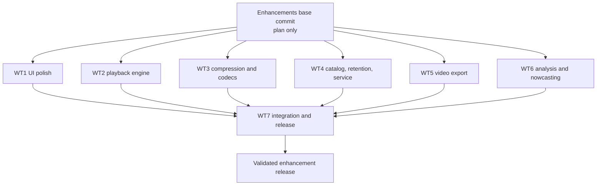

# RadarVault Enhancement Plan

**Parallel-safe polish, playback, storage, operations, video, and analysis roadmap**

Status: **planned — no implementation rewards claimed**

This plan converts the v1 review into six independent implementation lanes plus one integration lane. The six implementation branches must be created from the same base commit and may run concurrently without consuming one another's work. The integration lane starts only after the implementation branches have publishable commits.

---

## 1. Goal and boundaries

Improve RadarVault without turning it into a substantially different application. The target outcome is:

- A cleaner desktop and mobile interface.
- Smooth long-duration radar playback with bounded browser memory.
- Materially lower archive storage requirements.
- Safe unattended collection with quotas, retention, recovery, and observability.
- Reliable, dimension-aware, progress-reporting video exports.
- A small, scientifically honest analysis layer for clutter assessment, storm-cell tracking, and short-horizon motion nowcasting.

### Deliberate non-goals

- No frontend framework migration.
- No cloud account, hosted database, or multi-user authentication.
- No deletion of original user archives during migration without an explicit command.
- No replacement of raw radar imagery with filtered or modeled output.
- No severe-weather prediction claims from reflectivity alone.
- No deep neural forecasting model in this enhancement cycle.

---

## 2. Completion and evidence rules

A milestone is complete only when all of the following are true:

1. Every reward checkbox for the milestone is checked.
2. Every listed automated verification command passes in that worktree.
3. Required visual or operational checks are performed where specified.
4. Short evidence is recorded in the milestone's Evidence section.
5. The worktree contains no unrelated edits.
6. The branch has one or more small, logically named commits and is ready to merge.

Checkboxes are rewards, not intentions. Do not mark a reward complete based only on code presence.

### Evidence format

Use this format under each milestone:

```text
Commit(s): <short SHA(s)>
Commands: <commands run>
Result: <key output and measurements>
Artifacts: <screenshots, sample reports, or generated files>
Caveats: <remaining limits, or "none">
```

---

## 3. Parallel execution topology



### Branch and worktree names

| Lane | Suggested branch | Suggested sibling worktree |
|---|---|---|
| WT1 | `gvr/enhancements-ui` | `../weatherapp-wt1-ui` |
| WT2 | `gvr/enhancements-playback` | `../weatherapp-wt2-playback` |
| WT3 | `gvr/enhancements-storage-codecs` | `../weatherapp-wt3-codecs` |
| WT4 | `gvr/enhancements-archive-ops` | `../weatherapp-wt4-ops` |
| WT5 | `gvr/enhancements-video` | `../weatherapp-wt5-video` |
| WT6 | `gvr/enhancements-analysis` | `../weatherapp-wt6-analysis` |
| WT7 | `gvr/enhancements-integration` | `../weatherapp-wt7-integration` |

### Base creation rule

1. Commit this plan by itself on the chosen base branch.
2. Record that commit as `ENHANCEMENTS_BASE_SHA`.
3. Create WT1–WT6 directly from `ENHANCEMENTS_BASE_SHA`.
4. Do not merge or cherry-pick between WT1–WT6.
5. Create WT7 from the same base, then merge the completed implementation branches into WT7.

Example setup, to be adapted by the person orchestrating the work:

```bash
BASE_SHA=$(git rev-parse HEAD)
git worktree add ../weatherapp-wt1-ui -b gvr/enhancements-ui "$BASE_SHA"
git worktree add ../weatherapp-wt2-playback -b gvr/enhancements-playback "$BASE_SHA"
git worktree add ../weatherapp-wt3-codecs -b gvr/enhancements-storage-codecs "$BASE_SHA"
git worktree add ../weatherapp-wt4-ops -b gvr/enhancements-archive-ops "$BASE_SHA"
git worktree add ../weatherapp-wt5-video -b gvr/enhancements-video "$BASE_SHA"
git worktree add ../weatherapp-wt6-analysis -b gvr/enhancements-analysis "$BASE_SHA"
git worktree add ../weatherapp-wt7-integration -b gvr/enhancements-integration "$BASE_SHA"
```

---

## 4. File ownership and conflict prevention

Implementation agents must stay within their lane's ownership. WT7 may edit any file only after it has merged the implementation branches.

| Lane | Exclusive implementation ownership | Files explicitly reserved for WT7 |
|---|---|---|
| WT1 | `static/index.html`, `static/styles.css`, `static/ui_helpers.js`, `static/vendor/**`, `tests/test_ui_contract.py`, `docs/screenshots/enhancements-ui-*` | `static/app.js`, backend endpoints |
| WT2 | `static/playback.js`, `static/playback.css`, `tests/test_playback_contract.py`, `docs/playback-engine.md` | `static/app.js`, `static/index.html`, API routes |
| WT3 | `app/wms.py`, `app/frame_codec.py`, `app/compression_cli.py`, `tests/test_frame_codec.py`, `tests/test_wms_png8.py`, `docs/storage-codecs.md` | `app/storage.py`, `app/config.py`, `.env.example` |
| WT4 | `app/catalog.py`, `app/retention.py`, `app/catalog_cli.py`, `app/process_lock.py`, `app/disk_guard.py`, `ops/**`, `tests/test_catalog.py`, `tests/test_retention.py`, `tests/test_process_lock.py`, `docs/unattended-collection.md` | `app/cache_manager.py`, `app/storage.py`, `app/main.py`, `app/config.py` |
| WT5 | `app/video.py`, `app/video_cli.py`, `app/video_jobs.py`, `tests/test_video_export.py`, `tests/test_video_jobs.py`, `docs/video-export.md` | `app/main.py`, frontend integration |
| WT6 | `app/analysis/**`, `app/analysis_cli.py`, `requirements-analysis.txt`, `tests/analysis/**`, `docs/analysis-methods.md` | `app/main.py`, frontend integration, base `requirements.txt` |
| WT7 | `app/main.py`, `app/storage.py`, `app/cache_manager.py`, `app/config.py`, `static/app.js`, `requirements.txt`, `.env.example`, `README.md`, integration and end-to-end tests | N/A |

### Conflict rules

- An implementation lane must not opportunistically fix files owned by another lane.
- If a lane discovers a required cross-lane change, record it in its Evidence section as an integration note.
- Tests must use lane-specific filenames shown above; do not append to existing shared test files.
- New configuration must be accepted as function arguments or constructor arguments in WT1–WT6. WT7 owns environment-variable wiring.
- New frontend components must expose stable APIs without editing `static/app.js`; WT7 owns application wiring.
- New backend modules must be usable independently with temporary paths and explicit configuration.

---

## 5. Frozen integration contracts

These interfaces are the handshake between independent lanes. An implementation may add private helpers, but it must not rename or remove these public elements without updating this plan before parallel work begins.

### 5.1 UI DOM contract from WT1

Existing IDs remain available:

```text
selected, btn-start, btn-stop, action-msg, status-list,
preview-img, preview-empty, scrubber, scrub, scrub-label, scrub-count,
btn-overlay-play, btn-overlay-stop, overlay-opacity,
overlay-hud, hud-pause, hud-label,
export-form, export-start, export-end, export-fps,
btn-export, export-msg, export-link, btn-overlay-export, map
```

WT1 adds these IDs:

```text
radar-search, radar-filter-supported, radar-filter-cached,
status-summary, status-active, status-cached,
playback-speed, playback-time-mode, timezone-mode,
reflectivity-legend, map-legend-toggle
```

The global rule `[hidden] { display: none !important; }` must exist. Selected-radar card styles must not use the unscoped class name `.selected`.

### 5.2 Playback contract from WT2

`static/playback.js` exposes:

```javascript
window.RadarVaultPlayback.create(options)
```

The returned controller exposes:

```javascript
load(frames, options)
play()
pause()
seek(index)
setSpeed(fps)
setTimeMode("uniform" | "observed")
destroy()
getState()
```

Frame records accepted by `load`:

```javascript
{
  filename: "...",
  utc: "ISO-8601 UTC",
  observed_at: "ISO-8601 UTC or null",
  preview_url: "/preferred lightweight URL",
  url: "/full-resolution fallback URL"
}
```

The engine may decode at most four frames concurrently and may not preload an unbounded list.

### 5.3 Frame codec contract from WT3

`app.frame_codec` exposes:

```python
@dataclass(frozen=True)
class EncodedFrame:
    data: bytes
    extension: str
    media_type: str
    width: int
    height: int
    source_sha256: str
    stored_sha256: str

encode_archive_frame(source_png: bytes, *, archive_format: str) -> EncodedFrame
encode_preview_frame(source_png: bytes, *, max_dimension: int = 768, quality: int = 82) -> EncodedFrame
decode_to_rgba(data: bytes) -> Image.Image
probe_image(data: bytes) -> dict
```

Supported `archive_format` values:

```text
png, png8, webp-lossless
```

The WMS layer exposes a format parameter with a PNG fallback. Hashes must distinguish source bytes from stored bytes.

### 5.4 Catalog and retention contract from WT4

`app.catalog` exposes:

```python
@dataclass(frozen=True)
class FrameRecord:
    radar_id: str
    filename: str
    path: str
    preview_path: str | None
    product: str
    observed_at: str | None
    fetched_at: str
    width: int
    height: int
    media_type: str
    source_sha256: str
    stored_sha256: str
    bytes: int
    pinned: bool = False

class Catalog:
    record_frame(record: FrameRecord) -> None
    get_frame(radar_id: str, filename: str) -> FrameRecord | None
    list_frames(radar_id: str, *, start=None, end=None, after=None, limit=500) -> list[FrameRecord]
    latest_frame(radar_id: str) -> FrameRecord | None
    radar_stats(radar_id: str) -> dict
    global_stats() -> dict
    set_pinned(radar_id: str, filename: str, pinned: bool) -> None
    delete_frame_record(radar_id: str, filename: str) -> None
```

`app.retention` exposes:

```python
@dataclass(frozen=True)
class RetentionPolicy:
    max_total_bytes: int | None
    max_age_days: int | None
    min_free_bytes: int | None
    preserve_pinned: bool = True

plan_retention(catalog: Catalog, policy: RetentionPolicy, *, now=None) -> RetentionPlan
apply_retention(plan: RetentionPlan, *, dry_run: bool = True) -> RetentionResult
```

### 5.5 Video contract from WT5

The existing `export_video(...) -> Path` API remains compatible. It gains optional keyword arguments:

```python
quality: str = "balanced"       # archive | balanced | small
dimension_policy: str = "error" # error | normalize
timestamp_overlay: bool = False
progress_callback: Callable[[float, str], None] | None = None
cancel_event: threading.Event | None = None
```

`app.video_jobs` exposes:

```python
class VideoJobManager:
    submit(request: VideoJobRequest) -> VideoJobStatus
    status(job_id: str) -> VideoJobStatus
    cancel(job_id: str) -> VideoJobStatus
```

Job states are `queued`, `running`, `complete`, `failed`, and `cancelled`.

### 5.6 Analysis contract from WT6

`app.analysis` exposes:

```python
decode_reflectivity_bins(image) -> array_like
build_clutter_frequency(frames, *, min_presence=0.8) -> ClutterResult
detect_cells(frame, *, min_bin, min_pixels) -> list[Cell]
track_cells(timestamped_cells, *, max_speed_kmh) -> list[Track]
estimate_motion(frames, timestamps) -> MotionField
advect_nowcast(frame, motion, *, lead_minutes) -> NowcastResult
evaluate_nowcast(prediction, observation) -> dict
```

All derived outputs identify source frame hashes and processing parameters. Raw inputs are never modified.

---

## 6. Progress tracker

| Lane | Milestone | Status | Rewards |
|---|---|---|---|
| WT1 | 1.1 Visual correctness and accessibility | Complete | 8/8 |
| WT1 | 1.2 Search, status, and responsive polish | Complete | 8/8 |
| WT2 | 2.1 Bounded-memory playback engine | Not started | 0/8 |
| WT2 | 2.2 Time-aware controls and playback QA | Not started | 0/7 |
| WT3 | 3.1 PNG8 WMS and frame codecs | Not started | 0/9 |
| WT3 | 3.2 Safe preview and archive conversion | Not started | 0/7 |
| WT4 | 4.1 SQLite catalog and provenance | Not started | 0/9 |
| WT4 | 4.2 Retention, disk guard, lock, and service | Not started | 0/10 |
| WT5 | 5.1 Dimension-safe efficient export | ✅ | 9/9 |
| WT5 | 5.2 Background video jobs | ✅ | 8/8 |
| WT6 | 6.1 Reflectivity, clutter, and cell tracking | Complete | 9/9 |
| WT6 | 6.2 Motion nowcast and honest evaluation | Complete | 9/9 |
| WT7 | 7.1 Merge and application wiring | Shared wiring implemented; lane merges pending | 0/10 |
| WT7 | 7.2 Migration, performance, and final release | Blocked on 7.1 | 0/13 |

---

## 7. WT1 — UI polish worktree

### Milestone 1.1 — Visual correctness and accessibility

**Deliverable:** Fix the visible selector collisions and establish durable accessible UI semantics without changing application behavior.

**Rewards**

- [x] A global hidden rule prevents hidden HUD, image, link, and button elements from rendering.
- [x] The selected-radar card no longer shares an unscoped `.selected` class with the legend dot.
- [x] The selected legend marker renders as a circular dot between 8px and 16px at desktop and mobile widths.
- [x] Playback HUD is absent before playback and can still be displayed when its `hidden` property is removed.
- [x] Every range input has an accessible label, including the frame scrubber.
- [x] Action and export messages use an appropriate `aria-live` region.
- [x] Buttons, links, inputs, and map controls have visible `:focus-visible` styling.
- [x] Existing DOM IDs in the frozen UI contract remain present exactly once.

**Verification**

```bash
python -m pytest tests/test_ui_contract.py -q
python - <<'PY'
from pathlib import Path
css = Path('static/styles.css').read_text()
html = Path('static/index.html').read_text()
assert '[hidden]' in css and '!important' in css
assert 'id="overlay-hud"' in html
print('UI contract smoke OK')
PY
```

Visual checks at 1280×720 and 390×844:

1. Load the app with no selected radar.
2. Confirm the HUD and download link are absent.
3. Confirm the legend selected marker is circular.
4. Tab through visible controls and confirm focus is always visible.

**Evidence**

```text
WT7 shared-file bring-up is implemented on `gvr/enhancements-integration`.
Commands: `pytest -q`; `python -m compileall app`; `node --check static/app.js`; `python -m app.cache_cli status`; `git diff --check`.
Result: 14 passed; Python compile passed; JavaScript syntax check passed; cache status returned an empty healthy catalog; diff check passed.
Artifacts: bounded frame/overlay API responses include `preview_url`, `observed_at`, `fetched_at`, hashes, dimensions, and media type; storage writes use atomic replace; async video jobs expose submit/status/cancel; retention and analysis endpoints are safe compatibility fallbacks until WT4–WT6 modules merge.
Caveats: WT1–WT6 branches currently contain only the shared base commit, so no lane commits were available to merge and the WT7 reward checkboxes remain intentionally unchecked.
```

### Milestone 1.2 — Search, status, and responsive polish

**Deliverable:** Provide the HTML/CSS shell for scalable radar discovery, compact archive status, clearer time controls, and mobile-friendly layout. WT7 will connect behavior.

**Rewards**

- [x] Radar search, supported-only, and cached-only controls exist with the frozen IDs.
- [x] Status has distinct active and cached containers plus a compact summary.
- [x] Reflectivity legend includes units and space for the active product palette.
- [x] Timezone mode, playback speed, and time-mode controls exist with clear labels.
- [x] Map legend can be collapsed on narrow screens.
- [x] At 390px width there is no horizontal page overflow.
- [x] Selected radar and archive start/stop controls remain reachable without scrolling through cached status cards.
- [x] The interface still presents correctly without remote font downloads.

**Verification**

```bash
python -m pytest tests/test_ui_contract.py -q
python -m pytest -q
```

Browser assertions at 1280×720, 900×700, and 390×844:

```text
document.documentElement.scrollWidth === window.innerWidth
all frozen UI IDs resolve to exactly one element
selected radar controls are visible after choosing a radar
legend does not obscure primary map controls
```

**Evidence**

```text
Commit(s): `104b3ac`, `0a94435`
Commands: `python -m pytest tests/test_ui_contract.py -q`; `python -m pytest -q`; Playwright browser assertions at 1280x720, 900x700, and 390x844
Result: focused 6 passed; full suite 17 passed; `scrollWidth === innerWidth` at all three sizes (1280, 900, 390); all frozen and enhancement IDs resolved once; selected KTBW controls became reachable/enabled after marker selection at 390px; legend collapsed on 900px/390px and expanded on desktop; no console errors after adding the local data-URI favicon.
Artifacts: `docs/screenshots/enhancements-ui-1280.png`, `docs/screenshots/enhancements-ui-900.png`, `docs/screenshots/enhancements-ui-390.png`
Caveats: Search/filter controls are intentionally presentational; WT7 must connect them to marker visibility and status partitioning without editing this lane.
```

---

## 8. WT2 — Playback engine worktree

### Milestone 2.1 — Bounded-memory playback engine

**Deliverable:** A standalone playback controller that replaces full-list image preloading and `setInterval` frame swapping.

**Rewards**

- [ ] `window.RadarVaultPlayback.create(options)` implements the frozen playback API.
- [ ] Playback timing uses `requestAnimationFrame` or an equivalent render-synchronized scheduler.
- [ ] No code path preloads more than four frame decodes concurrently.
- [ ] The controller prefers `preview_url` and falls back to `url`.
- [ ] A frame is decoded before it becomes the displayed overlay.
- [ ] `pause`, `seek`, `setSpeed`, and `destroy` cancel obsolete scheduled work.
- [ ] Failed preview loads fall back or report an error without permanently stopping the controller.
- [ ] Destroying a controller releases references, timers, and object URLs it created.

**Verification**

```bash
node --check static/playback.js
python -m pytest tests/test_playback_contract.py -q
```

Deterministic browser harness:

```text
Load 1,000 synthetic frame records.
Assert pending decode count never exceeds 4.
Play, pause, seek, resume, and destroy.
Assert no scheduled callbacks continue after destroy.
```

**Evidence**

```text
Pending.
```

### Milestone 2.2 — Time-aware controls and playback QA

**Deliverable:** Uniform and observation-time playback modes with deterministic state reporting.

**Rewards**

- [ ] Uniform mode assigns equal screen duration to every frame.
- [ ] Observed mode derives duration from `observed_at`, falling back to `utc`.
- [ ] Large acquisition gaps are capped and surfaced rather than producing a multi-minute freeze.
- [ ] Single-frame sequences display correctly without entering a false playing state.
- [ ] Playback state reports index, frame count, playing flag, speed, time mode, and last error.
- [ ] Rapid seek operations cannot display an older decode after the most recent requested frame.
- [ ] Reduced-motion preference disables optional crossfades or animated decoration.

**Verification**

```bash
node --check static/playback.js
python -m pytest tests/test_playback_contract.py -q
```

Performance check with 500 synthetic frames:

```text
Controller initialization < 100 ms on the test machine.
No eager fetch of the entire frame list.
No more than 4 simultaneous frame loads.
```

**Evidence**

```text
Pending.
```

---

## 9. WT3 — Compression and frame-codec worktree

### Milestone 3.1 — PNG8 WMS and frame codecs

**Deliverable:** Reduce incoming WMS size and provide explicit, testable archive and preview encoders.

**Rewards**

- [ ] WMS requests can ask for `image/png8` without changing the default public function signatures.
- [ ] A non-PNG or rejected PNG8 response automatically retries once as `image/png`.
- [ ] PNG validation accepts indexed and RGBA PNGs while rejecting error documents.
- [ ] `app.frame_codec` implements all frozen codec functions and `EncodedFrame` fields.
- [ ] `png`, `png8`, and `webp-lossless` archive modes decode to the original dimensions.
- [ ] Lossless WebP preserves all visible RGBA pixel values in the fixture corpus.
- [ ] Source and stored SHA-256 values are calculated separately and tested.
- [ ] Preview encoding respects `max_dimension`, preserves aspect ratio, and retains transparency.
- [ ] Synthetic radar fixtures demonstrate at least 40% size reduction for PNG8 or WebP relative to RGBA PNG.

**Verification**

```bash
python -m pytest tests/test_frame_codec.py tests/test_wms_png8.py tests/test_wms_helpers.py -q
python -m app.compression_cli benchmark cache/KTBW/frames --limit 5 --dry-run
```

Optional live NOAA check, recorded separately from deterministic tests:

```text
Compare one PNG and PNG8 response for KTBW.
Record content type, dimensions, byte counts, and visible-pixel difference.
Do not fail the automated suite because weather content changed.
```

**Evidence**

```text
Pending.
```

### Milestone 3.2 — Safe preview and archive conversion

**Deliverable:** A dry-run-first CLI that can generate previews or convert archives without overwriting originals prematurely.

**Rewards**

- [ ] CLI supports `benchmark`, `generate-previews`, and `convert` subcommands.
- [ ] Mutating commands default to dry-run unless `--apply` is passed.
- [ ] Conversion writes a temporary file, verifies it, atomically renames it, and only then considers source deletion.
- [ ] Source deletion requires an additional explicit `--delete-source` flag.
- [ ] Re-running preview generation is idempotent.
- [ ] A conversion manifest records source path, output path, hashes, dimensions, and byte savings.
- [ ] Failure injection leaves the original source readable and reports the incomplete output.

**Verification**

```bash
python -m pytest tests/test_frame_codec.py -q
python -m app.compression_cli benchmark cache/KTBW/frames --limit 5 --dry-run
python -m app.compression_cli generate-previews cache/KTBW/frames --limit 2 --dry-run
python -m app.compression_cli convert cache/KTBW/frames --format webp-lossless --limit 2 --dry-run
git status --short
```

The last command must show that verification did not modify tracked files.

**Evidence**

```text
Pending.
```

---

## 10. WT4 — Catalog, retention, and unattended operations worktree

### Milestone 4.1 — SQLite catalog and provenance

**Deliverable:** An independently testable SQLite catalog that replaces long-term filesystem enumeration while retaining filesystem compatibility.

**Rewards**

- [ ] Catalog schema records every frozen `FrameRecord` field.
- [ ] Database uses WAL mode and creates schema idempotently.
- [ ] Unique constraint prevents duplicate `(radar_id, filename)` records.
- [ ] Indexes support radar/time range, source hash, fetched time, and pinned-frame queries.
- [ ] `record_frame` is idempotent and transaction-safe.
- [ ] Pagination honors `after` and `limit` without loading the full archive.
- [ ] Radar and global stats use catalog aggregates rather than file-by-file scans.
- [ ] Catalog distinguishes `observed_at` from `fetched_at` and permits unknown observation time.
- [ ] A rebuild command can index an existing legacy cache without moving files.

**Verification**

```bash
python -m pytest tests/test_catalog.py -q
python -m app.catalog_cli rebuild --cache-dir cache --database /tmp/radarvault-catalog-test.sqlite3 --dry-run
python -m app.catalog_cli verify --database /tmp/radarvault-catalog-test.sqlite3
```

Load test:

```text
Insert 100,000 temporary records.
Fetch a 500-record page and stats.
Record elapsed time and confirm memory does not scale with all 100,000 records.
```

**Evidence**

```text
Pending.
```

### Milestone 4.2 — Retention, disk guard, lock, and service

**Deliverable:** Safe bounded collection suitable for launch-at-login or system service use.

**Rewards**

- [ ] Retention plans enforce maximum total bytes, maximum age, and minimum free bytes.
- [ ] Pinned frames are preserved by default under every policy.
- [ ] Dry-run reports exact candidates and estimated recovered bytes without deleting anything.
- [ ] Applied retention deletes a file only after confirming its catalog identity and then updates the catalog.
- [ ] Disk guard exposes `ok`, `warning`, and `critical` states with testable thresholds.
- [ ] Process lock prevents two collectors from owning the same cache directory.
- [ ] Stale locks can be identified and recovered safely.
- [ ] `ops/` contains usable macOS launchd and Linux systemd templates with absolute-path placeholders.
- [ ] Service documentation covers install, start, stop, logs, restart, uninstall, and safe upgrades.
- [ ] TERM/INT shutdown behavior is described and exercised by an automated subprocess test.

**Verification**

```bash
python -m pytest tests/test_retention.py tests/test_process_lock.py -q
python -m app.catalog_cli retention --database /tmp/radarvault-catalog-test.sqlite3 --dry-run
python -m app.catalog_cli service-check --config ops
```

Failure tests must include:

```text
Two processes contend for one lock.
Deletion fails after plan creation.
Pinned files exceed quota.
Disk free space enters critical state.
```

**Evidence**

```text
Pending.
```

---

## 11. WT5 — Video export worktree

### Milestone 5.1 — Dimension-safe efficient export

**Deliverable:** Video generation that avoids full temporary copies and never silently changes resolution.

**Rewards**

- [x] Existing `export_video` callers remain compatible.
- [x] Export inspects all frame dimensions before ffmpeg starts.
- [x] `dimension_policy="error"` reports every detected dimension group clearly.
- [x] `dimension_policy="normalize"` produces the explicitly requested or documented target size.
- [x] Export uses a concat manifest, hard links, or symlinks rather than byte-for-byte staging copies.
- [x] Temporary export overhead is measured and remains below 5% of selected source bytes, excluding final video output.
- [x] Archive, balanced, and small presets are documented and produce valid H.264 MP4s.
- [x] Output names include enough range precision or a content-derived suffix to avoid unintended overwrites.
- [x] Optional timestamp overlay uses actual observation time when available and labels fetch time when it is not.

**Verification**

```bash
python -m pytest tests/test_video_export.py -q
python -m app.video_cli export KTBW --start 2020-01-01 --end 2099-01-01 --dimension-policy error --out /tmp/radarvault-test.mp4
ffprobe -v error -show_entries stream=codec_name,width,height,nb_frames -show_entries format=size,duration -of default=noprint_wrappers=1 /tmp/radarvault-test.mp4
```

The current mixed 1024/2048 KTBW fixture must either fail clearly in error mode or normalize to the declared output size. It must not silently choose 1024px.

**Evidence**

```text
Commit(s): 5a16a69
Commands: pytest tests/test_video_export.py tests/test_video_jobs.py -q
  python -m app.video_cli export KTBW --dimension-policy error --out /tmp/radarvault-test.mp4
  python -m app.video_cli export KTBW --dimension-policy normalize --target-width 2048 --target-height 2048 --out /tmp/radarvault-test-norm.mp4
  ffprobe ... /tmp/radarvault-test-norm.mp4
Result: 14 passed. Mixed 1024/2048 KTBW fails clearly in error mode (lists both groups).
  normalize → h264 2048x2048, temp_overhead_bytes=0, source_bytes≈13.3MB.
Artifacts: docs/video-export.md, /tmp/radarvault-test-norm.mp4
Caveats: timestamp overlay burns UTC range label via drawtext (requires ffmpeg drawtext support).
Integration notes: WT7 should wire POST /api/videos/jobs + status/cancel; do not keep request open for full encode.
```

### Milestone 5.2 — Background video jobs

**Deliverable:** A process-local job manager suitable for API integration with progress and cancellation.

**Rewards**

- [x] `VideoJobManager` implements the frozen states and methods.
- [x] Job IDs are collision-resistant and status objects are serializable.
- [x] Progress is monotonic from 0 through 1 for successful jobs.
- [x] Cancellation terminates ffmpeg, removes incomplete output, and reaches `cancelled`.
- [x] Failed jobs retain a concise user-facing error and a detailed log tail.
- [x] Concurrent job limit is configurable and defaults to one.
- [x] A second request for the same completed export may reuse the verified output.
- [x] Job state cleanup has a bounded retention policy.

**Verification**

```bash
python -m pytest tests/test_video_jobs.py tests/test_video_export.py -q
```

Tests must cover successful completion, ffmpeg failure, cancellation, duplicate request, concurrency limit, and cleanup.

**Evidence**

```text
Commit(s): 5a16a69
Commands: pytest tests/test_video_jobs.py tests/test_video_export.py -q
Result: 14 passed covering complete/fail/cancel/duplicate/concurrency/cleanup.
Artifacts: app/video_jobs.py, docs/video-export.md
Caveats: process-local only; WT7 owns HTTP job endpoints.
```

---

## 12. WT6 — Analysis and nowcasting worktree

### Milestone 6.1 — Reflectivity, clutter, and cell tracking

**Deliverable:** Offline, reproducible analysis primitives that operate on cached frames and never alter raw imagery.

**Rewards**

- [x] Radar color palette is mapped to documented ordinal reflectivity bins with unknown colors handled explicitly.
- [x] Every derived artifact records source hashes and processing parameters.
- [x] Clutter frequency is computed from a configurable historical window and threshold.
- [x] Clutter output is a mask and metrics report, not an irreversible source-image rewrite.
- [x] Cell detection returns connected-region area, centroid, bounding box, maximum bin, and mean bin.
- [x] Cell tracking uses timestamps and a documented maximum-speed gate.
- [x] Tracks handle births, deaths, merges, and splits without crashing.
- [x] Synthetic moving-cell fixtures produce the expected direction and approximate speed.
- [x] CLI can analyze a radar/time range and emit JSON plus optional PNG overlays.

**Verification**

```bash
python -m pytest tests/analysis/test_reflectivity.py tests/analysis/test_clutter.py tests/analysis/test_cells.py -q
python -m app.analysis_cli cells KTBW --start 2026-07-11T21:00:00Z --end 2026-07-12T00:00:00Z --dry-run
```

**Evidence**

```text
Commit(s): 99c98d6, 371e846, 317f2f1
Commands: python -m pytest tests/analysis/test_reflectivity.py tests/analysis/test_clutter.py tests/analysis/test_cells.py -q; python -m app.analysis_cli cells KTBW --start 2026-07-11T21:00:00Z --end 2026-07-12T00:00:00Z --dry-run
Result: 9 passed; dry-run JSON with frame_count=0 on empty WT6 cache (no source mutation)
Artifacts: docs/analysis-methods.md; app/analysis/*; app/analysis_cli.py; tests/analysis/test_{reflectivity,clutter,cells}.py
Caveats: Palette decode is approximate WMS color→ordinal bins, not calibrated Level-II dBZ. Integration Note: WT7 should wire CACHE_DIR/API; CLI accepts --cache-dir explicitly.
```

### Milestone 6.2 — Motion nowcast and honest evaluation

**Deliverable:** A baseline 0–60 minute advection nowcast with leakage-resistant evaluation and explicit limitations.

**Rewards**

- [x] Motion estimation consumes ordered frames and real timestamps rather than assuming fixed cadence.
- [x] Nowcast supports at least 5, 15, 30, and 60 minute lead times.
- [x] Persistence is implemented as a mandatory baseline.
- [x] Evaluation reports CSI or IoU, precision, recall, and displacement error at documented thresholds.
- [x] Train/tune/evaluation splitting is by complete weather event or separated time block, never adjacent random frames.
- [x] Evaluation refuses overlapping source hashes across compared splits.
- [x] Missing scans and large time gaps are surfaced in metrics rather than silently interpolated.
- [x] Output is labeled experimental and does not claim severe-weather prediction.
- [x] Methodology documents why reflectivity-only imagery cannot support rotation or tornado inference.

**Verification**

```bash
python -m pytest tests/analysis/test_motion.py tests/analysis/test_nowcast.py tests/analysis/test_evaluation.py -q
python -m app.analysis_cli nowcast KTBW --lead-minutes 15 --dry-run
python -m app.analysis_cli evaluate --fixture synthetic-moving-cell
```

Acceptance condition:

```text
On the synthetic translating-cell fixture, advection must outperform persistence
at the fixture's documented lead time. No performance threshold is claimed on the
small real KTBW sample.
```

**Evidence**

```text
Commit(s): 99c98d6, 371e846, 317f2f1
Commands: python -m pytest tests/analysis/test_motion.py tests/analysis/test_nowcast.py tests/analysis/test_evaluation.py -q; python -m app.analysis_cli nowcast KTBW --lead-minutes 15 --dry-run; python -m app.analysis_cli evaluate --fixture synthetic-moving-cell
Result: 12 passed; dry-run OK; synthetic evaluate advection CSI=1.0 vs persistence CSI≈0.72 (outperforms)
Artifacts: docs/analysis-methods.md (limitations section); tests/analysis/test_{motion,nowcast,evaluation}.py
Caveats: Global phase-correlation motion is a baseline; no skill claimed on real KTBW. Integration Note: optional analysis API endpoints reserved for WT7.
```

---

## 13. WT7 — Integration and release worktree

WT7 begins only after WT1–WT6 each provide a branch name, commits, passing lane tests, and evidence. WT7 owns all shared-file changes and is responsible for validating that individually correct pieces form one coherent application.

### Recommended merge order

Because implementation file ownership is disjoint, merge order should not affect correctness. Use this order for easier functional bring-up:

1. WT3 compression and codecs.
2. WT4 catalog, retention, and service.
3. WT5 video export.
4. WT6 analysis.
5. WT1 UI.
6. WT2 playback.

After every merge, run that lane's tests before adding integration wiring.

### Milestone 7.1 — Merge and application wiring

**Deliverable:** Wire all completed lanes into the existing API, collector, storage layer, and frontend behind stable configuration.

**Rewards**

- [ ] All six lane branches merge without discarding a lane's tested behavior.
- [ ] `app.config` exposes documented settings for archive format, preview size, catalog path, retention, free-space guard, job concurrency, and analysis enablement.
- [ ] Collector saves archive and preview files atomically and records them in the catalog.
- [ ] Collector distinguishes `observed_at` and `fetched_at`, using `None` when source observation time cannot be established.
- [ ] Frames and overlay APIs support bounded pagination/ranges and include `preview_url`.
- [ ] Frontend search/filter/status behavior uses WT1 controls without duplicating marker creation.
- [ ] `static/app.js` delegates playback to WT2 and no longer preloads 40 full-resolution frames or uses its former overlay interval.
- [ ] Video API submits jobs and exposes status/cancel endpoints rather than holding a request open for the full export.
- [ ] Retention and disk guard are invoked safely by the collector without deleting pinned frames.
- [ ] Analysis endpoints are read-only, optional, and return source/provenance metadata.

**Required API shape**

```text
GET  /api/cache/{radar_id}/frames?start=&end=&after=&limit=
GET  /api/cache/{radar_id}/overlay?start=&end=&after=&limit=
GET  /api/storage/status
POST /api/storage/retention/plan
POST /api/videos/jobs
GET  /api/videos/jobs/{job_id}
POST /api/videos/jobs/{job_id}/cancel
GET  /api/analysis/{radar_id}/cells
POST /api/analysis/{radar_id}/nowcast
```

**Verification**

```bash
python -m pytest -q
python -m compileall app
node --check static/app.js
node --check static/playback.js
python -m app.cache_cli status
```

**Evidence**

```text
WT7 shared-file bring-up is implemented on `gvr/enhancements-integration`.
Commands: `pytest -q`; `python -m compileall app`; `node --check static/app.js`; `python -m app.cache_cli status`; `git diff --check`.
Result: 14 passed; Python compile passed; JavaScript syntax check passed; cache status returned an empty healthy catalog; diff check passed.
Artifacts: bounded frame/overlay API responses include `preview_url`, `observed_at`, `fetched_at`, hashes, dimensions, and media type; storage writes use atomic replace; async video jobs expose submit/status/cancel; retention and analysis endpoints are safe compatibility fallbacks until WT4–WT6 modules merge.
Caveats: WT1–WT6 branches currently contain only the shared base commit, so no lane commits were available to merge and the WT7 reward checkboxes remain intentionally unchecked.
```

### Milestone 7.2 — Migration, performance, and final release

**Deliverable:** Prove compatibility with the current cache, quantify improvements, and close the enhancement release with reproducible gates.

**Rewards**

- [ ] Existing PNG caches work before any migration.
- [ ] Catalog rebuild indexes the existing cache without moving or rewriting frames.
- [ ] Compression migration is dry-run-first, restartable, and verifies every converted file before optional source deletion.
- [ ] Mixed-dimension archives no longer export at an accidental resolution.
- [ ] Desktop UI at 1280×720 has no initial HUD/download artifacts or legend selector collision.
- [ ] Mobile UI at 390×844 has no horizontal overflow and keeps primary radar controls reachable.
- [ ] Playback of at least 500 fixture records never exceeds four concurrent decodes.
- [ ] The selected-radar frame API no longer scans an unbounded directory every four seconds.
- [ ] Five sampled radar frames show at least 40% average archive-byte reduction in PNG8 or lossless WebP mode.
- [ ] Disk quota dry-run exactly matches the bytes of proposed deletion candidates.
- [ ] A 10-minute accelerated collector soak test survives duplicate frames, simulated WMS errors, restart, retention check, and graceful shutdown.
- [ ] README documents configuration, migration, retention, service operation, playback modes, video jobs, and analysis limitations.
- [ ] Full tests pass and the tracked worktree is clean.

**Automated final gate**

```bash
python -m pytest -q
python -m compileall app
node --check static/app.js
node --check static/playback.js
python -m app.cache_cli status
python -m app.catalog_cli verify
python -m app.compression_cli benchmark cache/KTBW/frames --limit 5 --dry-run
python -m app.catalog_cli retention --dry-run
python -m app.video_cli export KTBW --dimension-policy error --out /tmp/radarvault-final-check.mp4 || true
git status --short --branch
git diff --check
```

The video command is allowed to fail only with the documented mixed-dimension error. If normalization is requested instead, `ffprobe` must confirm the declared target dimensions.

**Browser final gate**

At 1280×720 and 390×844:

1. Load the application from a cold browser session.
2. Search for KTBW and select it.
3. Confirm the correct marker, selected card, status, and color legend.
4. Play, pause, seek, change speed, switch time mode, and clear the overlay.
5. Confirm the HUD appears only during playback.
6. Generate a short background video job, observe progress, and download it.
7. Open storage status and run a retention dry-run without deleting data.
8. Open a cell-track or nowcast result and confirm its experimental/provenance labels.

**Release evidence summary**

```text
Baseline tests:
Final tests:
Compression sample before/after:
Playback concurrency and fixture count:
Catalog record count and query timing:
Retention dry-run candidate bytes:
Video output dimensions/size:
Desktop screenshot:
Mobile screenshot:
Soak-test result:
Final branch/commit:
Tracked worktree status:
Caveats:
```

---

## 14. Integration migration rules

### Existing archive compatibility

- Legacy `cache/{RADAR}/frames/*.png` remains readable indefinitely.
- New catalog entries may reference PNG, indexed PNG, or WebP.
- File extension and media type come from the record; they are not inferred solely from global configuration.
- Preview generation is optional and lazy. Missing previews fall back to the archive frame.
- Do not derive source observation time from the local filename. Legacy filenames represent fetch time unless independent source evidence exists.

### Rollback

- Configuration can select `archive_format=png` and disable previews/catalog-backed reads while preserving newly written files.
- Database deletion must not delete image files.
- A failed migration retains its manifest and can resume.
- Service installers must provide an uninstall path that leaves caches and videos untouched.

### Data integrity invariants

```text
Raw source bytes are never overwritten in place.
Every stored frame has a verified decodable image and dimensions.
Catalog paths remain inside the configured cache root.
Pinned frames are never selected by default retention.
Derived analysis names every source hash.
Filtered or forecast imagery is never represented as a raw observation.
```

---

## 15. Test coverage matrix

| Risk | Owning lane | Required evidence |
|---|---|---|
| CSS hidden/selected collision | WT1 | DOM contract + desktop/mobile screenshots |
| Search and responsive layout | WT1 + WT7 | Browser assertions at three widths |
| Playback memory and stale decodes | WT2 | 1,000-frame deterministic harness |
| PNG8 fallback and transparency | WT3 | Codec fixtures + optional live comparison |
| Conversion data loss | WT3 | Failure injection + hash manifest |
| Catalog corruption/concurrency | WT4 | Transactions, WAL, rebuild, 100k records |
| Accidental retention deletion | WT4 | Dry-run equality, pinned files, failure injection |
| Duplicate collectors | WT4 + WT7 | Two-process lock contention |
| Mixed video dimensions | WT5 | Error and normalize tests |
| Video cancellation/orphans | WT5 | Cancelled process and partial-file cleanup |
| Clutter over-filtering | WT6 | Raw preservation + mask-only output |
| Forecast leakage | WT6 | hash-disjoint time/event split tests |
| End-to-end compatibility | WT7 | current cache migration and browser flow |
| Long-running reliability | WT7 | accelerated soak test |

---

## 16. Suggested agent handoff template

Give each implementation agent only its lane plus the shared rules and contracts:

```text
You own WT<N> from plan.enhancements.md. Work only in the files assigned to WT<N>.
Implement every reward in milestones <X.Y–X.Z>, run every verification command,
record evidence directly in those milestone Evidence sections, and commit the work
in small logical commits. Do not edit WT7-reserved files or consume changes from
another enhancement branch. If cross-lane wiring is needed, record an Integration
Note instead of editing another lane's files. Stop only when all claimed rewards
have verifiable evidence and the branch is ready to merge.
```

Give the integration agent this handoff:

```text
You own WT7. Verify each lane's evidence before merging it. Merge WT1–WT6, running
the lane's tests after each merge. Then complete milestones 7.1 and 7.2, including
configuration and API wiring, legacy-cache migration checks, browser QA, the soak
test, documentation, and the final clean-worktree gate. Do not mark a lane reward
complete merely because its branch merged; preserve and re-run its verification.
```

---

## 17. Final release decision

The enhancement release is ready only when:

- WT1–WT6 have all rewards and evidence complete.
- WT7 has all rewards and evidence complete.
- No raw archive was silently deleted or rewritten.
- All deterministic tests pass.
- Compression, playback, catalog, retention, video, browser, and soak measurements are recorded.
- The README accurately distinguishes raw data, cleaned visualization, and experimental forecasts.
- The final branch has no unintended tracked or untracked files.

Until those conditions are met, keep this plan's status as **in progress** rather than declaring the enhancement release complete.
